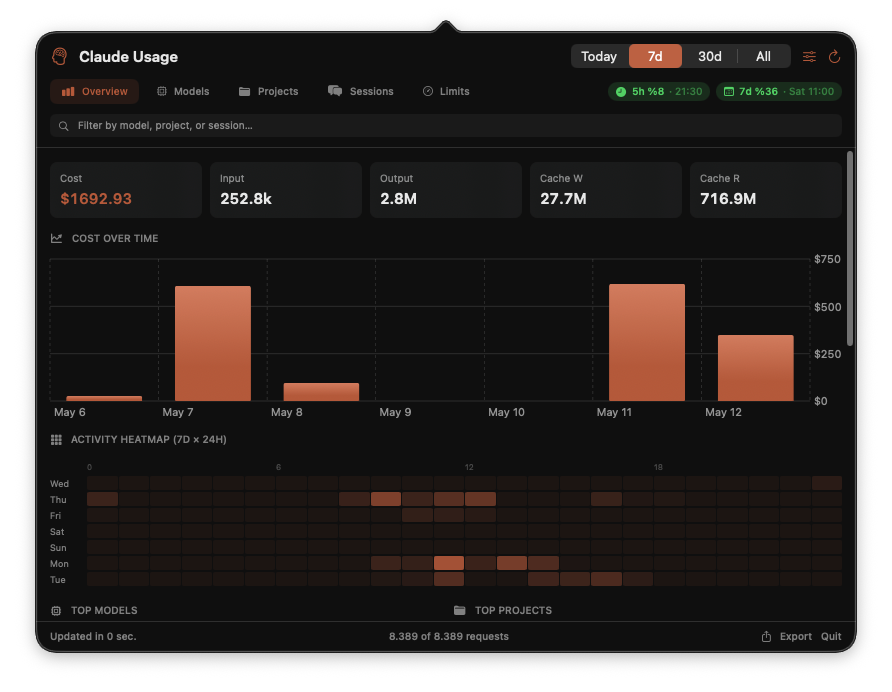
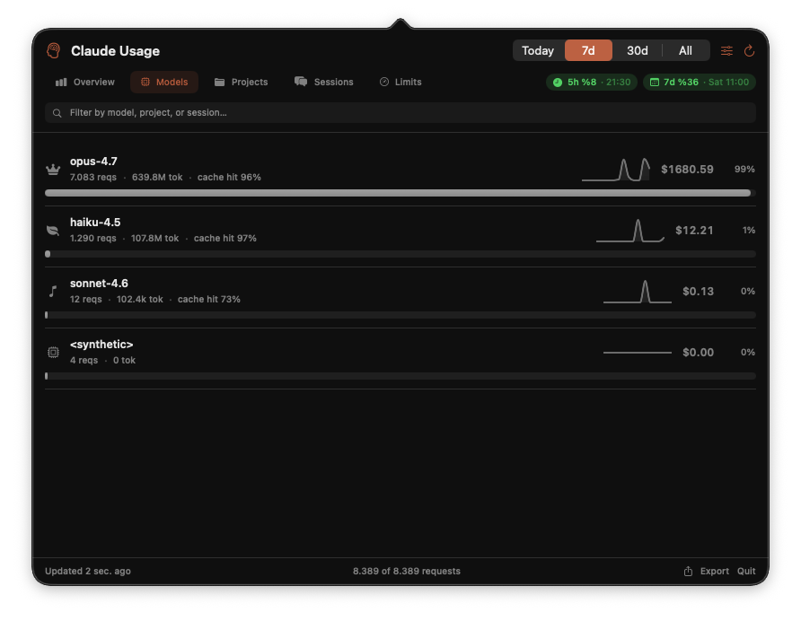
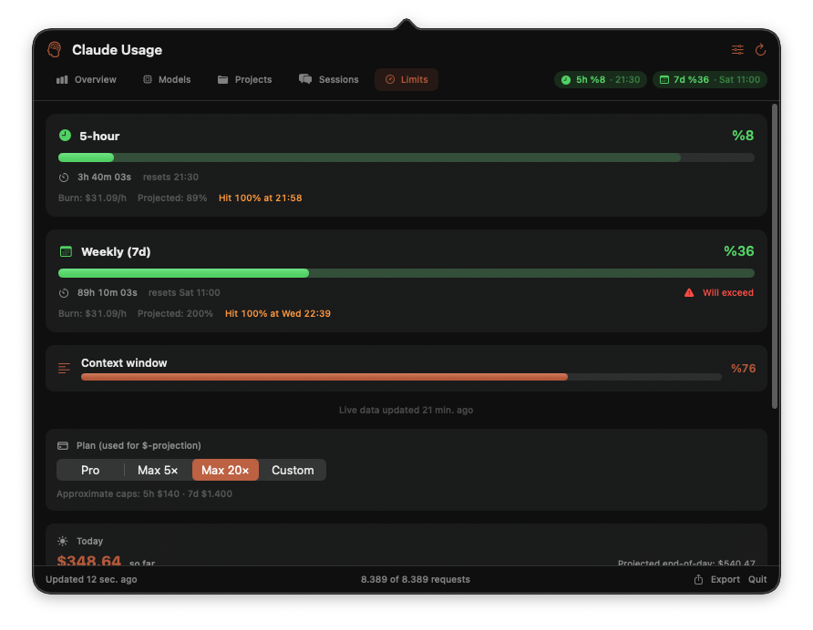

<div align="center">

# ⚡ Wattmeter

**Your Claude Code usage. In the menubar. Effortlessly.**

*A tiny native macOS app that turns `~/.claude/` into a real dashboard.*

[](#install)
[](#build-from-source)
[](#install)
[](LICENSE)
[](#privacy)

[**Download**](../../releases/latest) · [Screenshots](#screenshots) · [How it works](#how-it-works) · [Build](#build-from-source)

</div>

---

> *"How close am I to the weekly limit, actually?"*
>
> You opened a terminal. You ran a script. You parsed JSONL. You eyeballed a number.
> Now it just lives in your menubar.

---

## Screenshots

| Overview | Models | Limits |
| :---: | :---: | :---: |
|  |  |  |

## Why

Claude Code writes everything you need to a folder on your disk. Cost. Tokens. Rate-limit windows. Per-model breakdown. Per-project breakdown. It's all there — buried in JSONL transcripts, one file per session, scattered across nested directories.

Wattmeter reads it. Aggregates it. Renders it. **Live.**

No login. No API key. No telemetry. No cloud. The menubar icon and the data underneath both live on your Mac.

## Features

- 🔋 **Live 5-hour & weekly limits** — read straight from Claude Code's `statusLine` output. Same numbers it shows you.
- 💸 **Cost breakdown** — by model (Opus / Sonnet / Haiku), project, session. Sortable, filterable.
- 📈 **Burn-rate forecast** — projects time-to-limit at current trajectory. Knows when to slow down.
- 🌡️ **7×24 heatmap** — see your work rhythm at a glance.
- 🔔 **Threshold alerts** — toast at 75% / 90% / 100% of any limit. Configurable.
- ⚡ **Instant boot** — cached snapshot renders in <1s, parser streams the rest in-flight.
- 🔒 **Signed + notarized + hardened runtime** — Gatekeeper accepts it. No right-click bypass.

## Install

```bash
# Drag-drop install
open "$(gh release download --pattern '*.dmg' -O - 2>/dev/null)" 2>/dev/null \
  || curl -L -o Wattmeter.dmg https://github.com/emreisik95/wattmeter/releases/latest/download/Wattmeter.dmg \
  && open Wattmeter.dmg
```

Or [grab the DMG](../../releases/latest) the normal way → drag to `/Applications` → launch.

**First launch:** click **Connect to Claude limits**. Wattmeter patches `~/.claude/settings.json` so Claude Code writes a tiny JSON after every prompt. One Claude prompt later, the limit bars fill in.

## How it works

```
  ┌─ ~/.claude/projects/**.jsonl ──┐
  │  (every session you ever ran)  │
  └────────────┬───────────────────┘
               │  byte-prefilter
               │  mtime cache
               ▼
       Parser.swift  ── stream ──▶  UsageStore  ──▶  SwiftUI
                                       │
       ~/.claude/rate_limits.json ─────┘  (statusLine hook)
```

- **`Parser.swift`** — streaming JSONL with byte-level prefilter + per-file mtime cache. Reads only what changed.
- **`UsageStore.swift`** — `AsyncStream` refresh, 120ms UI throttle, persistent plist snapshot at `~/Library/Application Support/Wattmeter/`.
- **`Aggregator.swift`** — model / project / session / heatmap rollups.
- **`Forecasting.swift`** — burn-rate projection.
- **`Limits.swift`** — watches `~/.claude/rate_limits.json` with mtime + content-fingerprint dedup.
- **`Theme.swift`** — single Crail accent (`#C15F3C`) + semantic limit colors. Zero rainbow soup.

Pure SwiftUI + AppKit. **Zero external dependencies.** Builds in seconds.

## Privacy

Everything happens on your machine. Nothing leaves it. There is no analytics, no error reporting, no "phone home." If you `nettop` Wattmeter you'll see exactly zero outbound traffic.

The one file Wattmeter writes outside its own bundle is `~/.claude/settings.json` — a tiny `statusLine` hook so Claude Code emits live rate-limit numbers. You can remove it any time.

## Build from source

```bash
git clone https://github.com/emreisik95/wattmeter.git
cd wattmeter
swift build -c release
./build.sh           # → Wattmeter.app
open Wattmeter.app
```

Requires macOS 14+, Swift 5.10+, Xcode command-line tools.

## Release pipeline

One command. Bumps version, builds, signs, notarizes, staples, tags, publishes:

```bash
./scripts/release.sh 0.2.0
```

(Needs Developer ID cert + notarytool keychain profile `wattmeter` + `gh` auth.)

## Roadmap

- [ ] In-app auto-updates (Sparkle 2)
- [ ] Per-project budget alerts
- [ ] Export to CSV / JSON
- [ ] Linux + Windows? *(probably not, but tempting)*

## License

MIT — see [LICENSE](LICENSE). Use it. Fork it. Ship it.

---

<div align="center">

*Not affiliated with Anthropic. "Claude" and "Claude Code" are trademarks of Anthropic, PBC.*

<sub>Made with ⚡ on a Mac that was definitely over its weekly limit.</sub>

</div>
